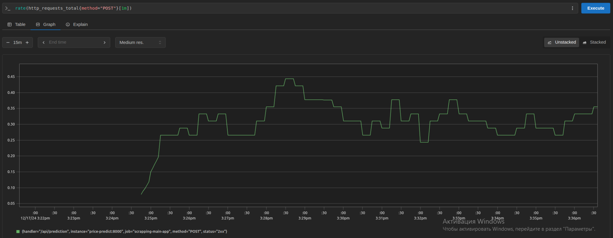
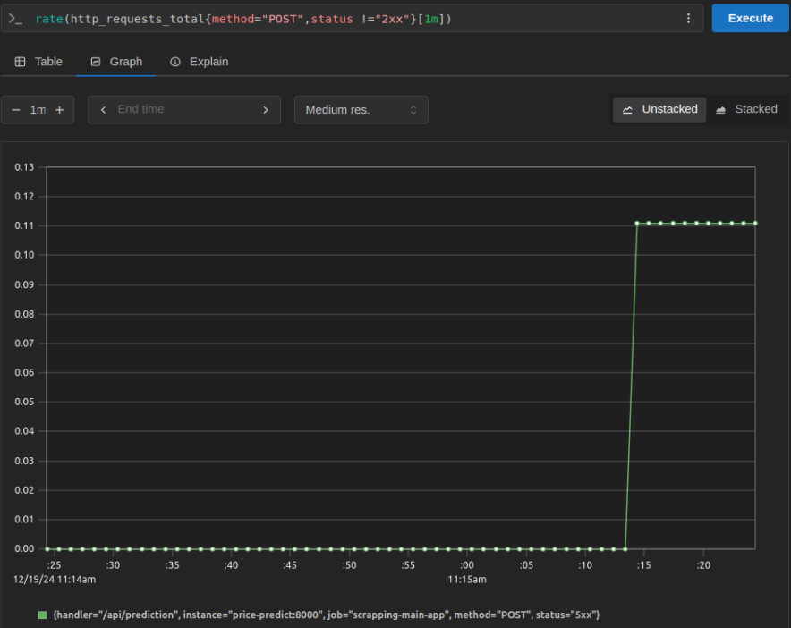
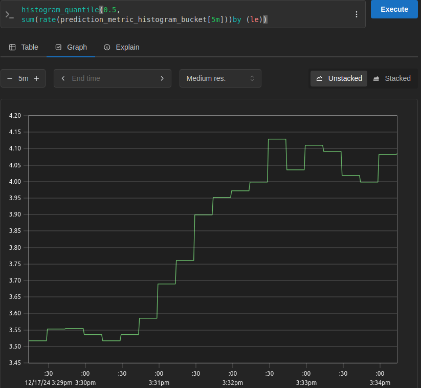
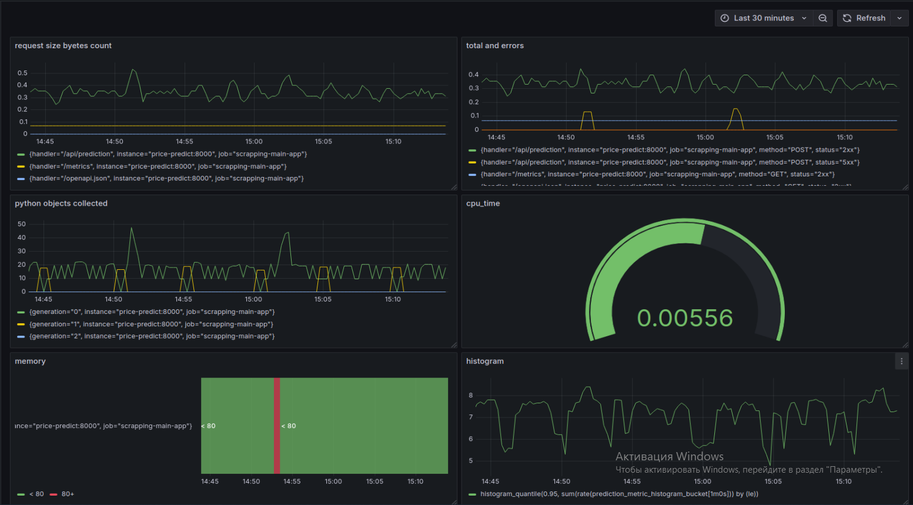

## Описание проекта
Проект посвящён решению задачи предсказания цен на автомобили https://www.kaggle.com/datasets/vijayaadithyanvg/car-price-predictionused-cars/data
## Запуск
Для запуска необходимо выполнить команды:
1. git clone https://github.com/SmetaninAS/IISLR1.git
2. cd IISLR1
3. python3 -m venv .venv
4. .venv\Scripts\activate.bat
5. pip install -r requirements.txt

## Исследование данных
Находится в ./eda/eda.ipynb\
**Основные результаты:**
* На этапе очистки данных были приведены к категориальному типу: Car_Name, Year, Fuel_Type, Selling_type, Transmission, уменьшение веса выборки удалось добиться путём приведения Selling_Price и Present_Price к float32, Driven_kms к int32, Owner к int8
* Таким образом удалось добиться снижения веса выборки до 6.4 кб
* Не было обнаружено нулевых значений, не было удалено столбцов/строк.
* Новые признаки не создавались\
**В ходе анализа были выявлены следующие закономерности:**
* Существует слабая корреляция между пройденным расстоянием и текущей ценой (./eda/heatmap.png)
* Наиболее выросли в цене авто 2004 - 2006 и 2008 - 2010 лет (./eda/lineplotPriceYear.png)
* Авто с дизельным топливом в среднем дороже, чем с бензиновым (./eda/histFuelPrPrice.png)
* Автомобили на автоматической коробке передач могут быть как сильно дороже, так и дешевле авто на механической (./eda/histTransPrPrice.png)
* Новые автомобили дороже (./eda/lineplotSePriceYear.png)
* Дилеры продают в 7 раз дороже
* Большинство автомобилей имеют 0 владельцев, однако, если у автомобиля 1 владелец, то, по статистике у него самая низкая цена, так как автомобили с 2 и 3 владельцами самые немногочисленные, но в среднем и самые дорогие.(./eda/bokeh.png)\
Все графики находятся в ../eda/<название графика.png>\
Обработанная выборка сохранена в файл ../data/clean_data.pkl
## MLFlow 
**Запуск mlflow** \
Скрипт для запуска находится в ./mlflow \
Для запуска необходимо выполнить source .\start_mlflow.sh \
**Результаты исследований** \
Лучший результат показала модель, полученная при подборе параметров с помощью optuna \
Метрики: 
* mae
0.5874850358150091
*  mape
0.541891938648121
* mse
1.9488293481156727

**Выбранные столбцы:** Present  Price и Driven_kms   
**Модель** Catboost\
**Параметры:**\
depth=6, learning_rate=0.03825\
run id 10608bdf12144244a280d59ca8ea6381\
Скриншоты с метриками и версиями находятся в папке research под названиями metrics.bmp и vesrions.bmp

## Сервис предсказаний цены
**Описание файлов в ml_services**
* api_handler.py - функции загрузки модели и предсказания цены 
* Dockerfile - докерфайл, содержащий параметры для сборки и запуска контейнера с предсказанием цены
* main.py - программа, описывающая запросы для FastApi и получение метрик по предсказанию
* requirements.txt - текстовый файл содержащий список необходимых для работы сервиса и конейнера библиотек\

**Описание файлов в models**
* get_model.py - программа, которая загружает модель из mlflow и сохраняет её в формате .pkl
* model.pkl - модель, которая используется для предсказаний\

**Команды, необходимые для создания образа и запуска контейнера**\
docker build . --tag car_model:2\
docker run -p 8001:8000 -v $(pwd)/../models:/models car_model:2\

Для проверки работоспособности можно зайти на http://localhost:8001/docs, выбрать prediction и указать параметры запроса, задав любой car_id.\
Пример запроса:\
{\
  "Car_Name": "ciaz",\
  "Year": 2017,\
  "Present_Price": 9.851562,\
  "Driven_kms": 6900,\
  "Fuel_Type": "Petrol",\
  "Selling_type": "Dealer",\
  "Transmission": "Manual",\
  "Owner": 0\
}\
**Описание файлов в grafana**\
New dashboard1 Copy-1734610453945.json - созданный дашборд.\
dashboard.bmp - *график созданного дашборда*\
Для проверки работоспособности можно зайти на http://localhost:3000 \
**Описание файлов в prometheus**\
rate_total.bmp - *график частоты запросов к основному сервису в минуту*\
eror.bmp - *график, отражающий ответы на ошибочные запросы*\
graphana.bmp - *первоначальный график дашборда*\
prometheus.yml - конфигурационный файл, описывающий сбор метрик\
Для проверки работоспособности можно зайти на http://localhost:9090 \
**Описание файлов в requests**\
Dockerfile - докерфайл, содержащий параметры для сборки и запуска контейнера с генерацией запросов для предсказаний\
req.py - код, случайно генерирующий некоторые параметры запроса\
requirements.txt -  текстовый файл содержащий список необходимых для работы сервиса и конейнера библиотек\
**Команды, необходимые для запуска**\
Запуск всех контейнеров и сервисов осуществляется путём использования docker compose. Сервисы описаны в файле compose.yml.\
Для запуска:\
docker compose up\
**Скриншоты мониторинга и дашборда**\
\
Отображает частоту запросов к основному сервису\
\
Отображает ответы на ошибочные запросы с некорректными запросами.\
\
Отображает гистограмму предсказаний модели\
\
Отображает созданный дашборд с графиками:\
* Метрика, отражающая статистику о размерах запросов, поступающих на сервер.
* Частота запросов к основному сервису (зеленый) и запросов с кодами ошибки (оранжевый)
* Метрика, отражающая суммарное количество объектов, которые были удалены сборщиком мусора.
* Значение в процентном эквиваленте для времени ожидания процессора
* Объём используемой в процентах оперативной памяти 
* Гистограмма предсказаний цены модели

